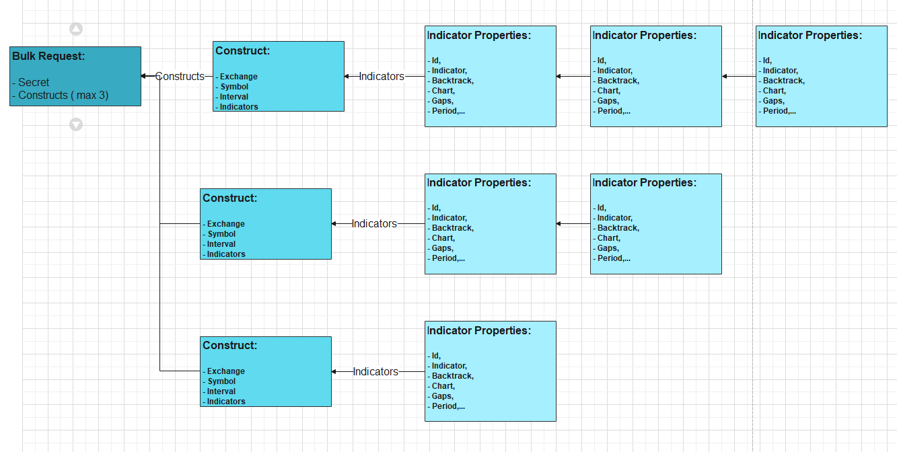
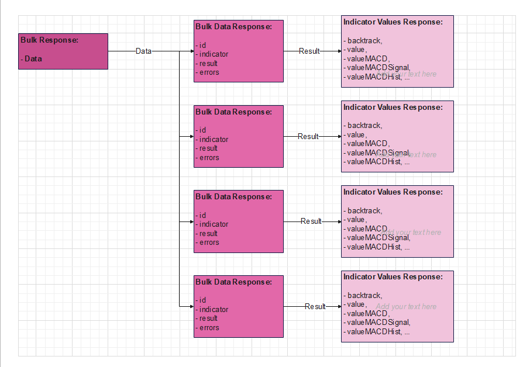

# TaapiClient
Client library for interacting with the Taapi.io API in C#. It allows you to fetch various technical indicators for financial markets.

**If you have any questions, suggestions, or you want to contribute to this project, feel free to contact me at** <info@grumson.eu>


## Table of Contents
- [Overview](#overview)
- [Features](#features)
- [Constructor](#constructor)
- [Methods](#methods)
- [Usage](#usage)
- [Suport this project](#suport)
- [Changelog](#changelog)


## Overview

The `TaapiClient` class is designed to interact with the Taapi.io API for fetching various indicator values, posting bulk indicator requests, and managing API rate limits. It provides asynchronous methods for making API requests and includes error handling for common HTTP and API errors.

#### Suported exchanges
- Binance, Binance Futures, BinanceUs, Coinbase, Kraken, Bitstamp, WhiteBIT, ByBit, GateIo

#### Supported indicators
- rsi, macd, sma, ema, stochastic, bbands, supertrend, atr, stochrsi, ma, dmi, candle, candles, fibonacci retracement, standard deviation, average directional movement


---

### Features

- Fetch individual indicator values asynchronously.
- Post bulk indicators asynchronously.
- Create bulk requests and constructs for multiple indicators.
- Handle various exceptions such as unauthorized access, rate limit exceeded, and more.

---

### Constructor

#### `TaapiClient`(string baseUrl = "https://api.taapi.io", int retryAfterSeconds = 60)

Initializes a new instance of the `TaapiClient` class.

- **Parameters**:
  - `baseUrl`: The base URL of the Taapi API (default: `"https://api.taapi.io"`).
  - `retryAfterSeconds`: Time in seconds to wait before retrying after rate limit (default: `60`).

---

### Methods

#### GetIndicatorAsync

Fetches indicator values asynchronously.

- **Parameters**:
  - `apiKey`: The API key used for authentication (must not be null or empty).
  - `symbol`: The symbol for which the indicator is fetched (must not be null or empty).
  - `exchange`: The exchange on which the symbol is traded.
  - `candlesInterval`: The time interval for the candles.
  - `directParametersRequest`: The properties for the requested indicator (must not be null).

- **Returns**:  
  A `Task<TaapiIndicatorValuesResponse>` representing the fetched indicator values.

- **Exceptions**:
  - `ArgumentException`: If required parameters are null or empty.
  - `UnauthorizedAccessException`: If the API key is invalid.
  - `RateLimitExceededException`: If the rate limit is exceeded.
  - Other exceptions for HTTP request errors.

  ---

#### [Obsolete] PostBulkIndicatorsAsync

**Deprecated.** Posts multiple indicator requests in bulk.
GetIndicatorAsync is deprecated, please use the new method `GetBulkIndicatorsResults` instead.

- **Parameters**:
  - `requests`: The request object containing multiple indicator requests.

- **Returns**:  
  A `Task<List<TaapiBulkResponse>>` containing the bulk response.

- **Exceptions**:  
  Same as `GetIndicatorAsync`.

---

#### GetBulkIndicatorsResults

Fetches multiple indicator results asynchronously in bulk.

- **Parameters**:
  - `requests`: The bulk request object containing multiple indicator requests.

- **Returns**:  
  A `Task<List<ITaapiIndicatorResults>>` containing the results of the requested indicators.

- **Exceptions**:  
  Same as `GetIndicatorAsync`.

  ---

#### CreateBulkRequest

Creates a bulk request for fetching multiple indicators.

- **Parameters**:
  - `apiKey`: The API key for authentication (must not be null or empty).
  - `bulkConstructList`: A list of bulk constructs for the indicators (must not be null).

- **Returns**:  
  A `TaapiBulkRequest` object.

- **Exceptions**:
  - `ArgumentException`: If parameters are null or empty.

  ---

#### CreateBulkConstruct

Creates a bulk construct for a specific exchange, symbol, and interval, and includes a list of indicators.

- **Parameters**:
  - `exchange`: The exchange where the symbol is traded.
  - `symbol`: The symbol for which to create the bulk construct (must not be null or empty).
  - `candlesInterval`: The interval for the candles.
  - `indicatorList`: A list of indicators (must not be null or empty).

- **Returns**:  
  A `TaapiBulkConstruct` object.

- **Exceptions**:
  - `ArgumentException`: If parameters are null or empty.

---

### Usage

Here is an example of how to use the `TaapiClient` class to retrieve indicator values in console application:
Make sure to replace `"YOUR_API_KEY"` with your actual Taapi API key.

```csharp

using TaapiLibrary.Contracts.Requests;
using TaapiLibrary.Enums;
using TaapiLibrary;
using TaapiLibrary.Contracts.Requests.Interfaces;
using TaapiLibrary.Contracts.Response.Bulk.Interfaces.Indicators;
using TaapiLibrary.Models.Indicators.Properties;


Console.WriteLine("Taapi Test App");


string TAAPI_API_KEY = "YOUR_API_KEY";

TaapiClient taapiClient = new TaapiClient();


// Create BNBUSDT list of indicators properties and add properties for each indicator
List<ITaapiIndicatorProperties> bnb_PropertiesList = new List<ITaapiIndicatorProperties>();

// Standard Deviation propertie
StandardDeviationIndicatorProperties stddev_bnb = new StandardDeviationIndicatorProperties {
    Id = "stddev_bnb",
    Chart = TaapiChart.Candles,
    Backtrack = 0,
    Period = 10,
    OptInNbDev = 2.0f,
};
bnb_PropertiesList.Add(stddev_bnb);

// Candle propertie
CandleIndicatorProperties candle_bnb = new CandleIndicatorProperties {
    Id = "candle_bnb",
    Chart = TaapiChart.Candles,
    Backtrack = 10,
};
bnb_PropertiesList.Add(candle_bnb);

// Candles propertie
CandlesIndicatorProperties candles_bnb = new CandlesIndicatorProperties {
    Id = "candles_bnb",
    Chart = TaapiChart.Candles,
    Backtrack = 0,
    Period = 10,
};
bnb_PropertiesList.Add(candles_bnb);

// Rsi propertie
RsiIndicatorProperties rsi_bnb = new RsiIndicatorProperties {
    Id = "rsi_bnb",
    Chart = TaapiChart.Candles,
    Backtrack = 0,
    Period = 10,
};
bnb_PropertiesList.Add(rsi_bnb);

// SuperTrend propertie
SuperTrendIndicatorProperties superTrend_bnb = new SuperTrendIndicatorProperties {
    Id = "supertrend_bnb",
    Chart = TaapiChart.Candles,
    Backtrack = 1,
    Period = 10,
    Multiplier = 3,
};
bnb_PropertiesList.Add(superTrend_bnb);

// Stoch rsi propertie
StochRsiIndicatorProperties stochRsi_bnb = new StochRsiIndicatorProperties {
    Id = "stochrsi_bnb",
    Chart = TaapiChart.Candles,
    Backtrack = 0,
    ChartGaps = false,
    DPeriod = 10,
    KPeriod = 9,
    RsiPeriod = 11,
    StochasticPeriod = 12,
};
bnb_PropertiesList.Add(stochRsi_bnb);

// Create Binance Futures BNBUSDT Bulk Construct from indicators properties ( rsi, superTrend, stochRsi,... )
var bnb_Construct = taapiClient.CreateBulkConstruct(TaapiExchange.BinanceFutures, "BNB/USDT", TaapiCandlesInterval.OneMinute, bnb_PropertiesList);


// Create BTCUSDT list of indicators properties and add properties for each indicator
List<ITaapiIndicatorProperties> btc_PropertiesList = new List<ITaapiIndicatorProperties>();

// Fibonacci retracement propertie
FibonacciRetracementIndicatorProperties fibonacci_btc = new FibonacciRetracementIndicatorProperties {
    Id = "fibonacciretracement_btc",
    Chart = TaapiChart.Candles,
    Backtrack = 1,
    Retracement = 0.618f,
    //FromTimestamp = "1767229200000", // From 2.01.2025 10:00:00
    //ToTimestamp = "1767229200000", // To 2.01.2025 13:00:00
    Period = 50,
};
btc_PropertiesList.Add(fibonacci_btc);

// MACD propertie
MacdIndicatorProperties macd_bnb = new MacdIndicatorProperties {
    Id = "macd_btc",
    Chart = TaapiChart.Heikinashi,
    Backtrack = 0,
    OptInFastPeriod = 10,
    OptInSignalPeriod = 11,
    OptInSlowPeriod = 12,
};
btc_PropertiesList.Add(macd_bnb);

// Create Binance Futures BTCUSDT 5 min candle interval Bulk Construct from indicators properties ( MACD,... )
var btc_Construct = taapiClient.CreateBulkConstruct(TaapiExchange.BinanceFutures, "BTC/USDT", TaapiCandlesInterval.OneHour, btc_PropertiesList);


List<TaapiBulkConstruct> constructs = new List<TaapiBulkConstruct>();
constructs.Add(bnb_Construct);
constructs.Add(btc_Construct);


// Get Bulk request for all indicators ( max 3 Constructs )
var bulk = taapiClient.CreateBulkRequest(TAAPI_API_KEY, constructs);


// Get results for indicators
var results = await taapiClient.GetBulkIndicatorsResults(bulk);


// Print results
if (results?.Count > 0) {
    foreach (var result in results) {

        // Get symbol from Id
        string symbol = result.Id.Split("_")[1].ToUpper();

        // CANDLE
        if (result is ICandleIndicatorResults candleResult) {
            DateTime dateTime = DateTimeOffset.FromUnixTimeSeconds((long)candleResult.Timestamp).DateTime;
            Console.WriteLine($"Symbol: {symbol} {dateTime.ToString("dd.MM.yy HH:mm:ss")} - Open: {candleResult.Open} - Close: {candleResult.Close} - High: {candleResult.High} - Low: {candleResult.Low} - Volume: {candleResult.Volume}");
        }
        // CANDLES
        else if (result is ICandlesIndicatorResults candlesResult) {
            foreach (var candle in candlesResult.Candles) {
                DateTime dateTime = DateTimeOffset.FromUnixTimeSeconds((long)candle.Timestamp).DateTime;
                Console.WriteLine($"Symbol: {symbol} {dateTime.ToString("dd.MM.yy HH:mm:ss")} - Open: {candle.Open} - Close: {candle.Close} - High: {candle.High} - Low: {candle.Low} - Volume: {candle.Volume}");
            }
        }
        // RSI
        else if (result is IRsiIndicatorResults rsiResult) {
            Console.WriteLine($"Symbol: {symbol} - RSI: {rsiResult.Value}");
        }
        // SuperTrend
        else if (result is ISuperTrendIndicatorResults superTrendResult) {
            Console.WriteLine($"Symbol: {symbol} - SuperTrend: {superTrendResult.Value} - {superTrendResult.ValueAdvice}");
        }
        // Stoch RSI
        else if (result is IStochRsiIndicatorResults stochRsiResult) {
            Console.WriteLine($"Symbol: {symbol} - " +
                $"Stoch RSI FastK:{stochRsiResult.ValueFastK} - FastD:{stochRsiResult.ValueFastD}");
        }
        // MACD
        else if (result is IMacdIndicatorResults macdResult) {
            Console.WriteLine($"Symbol: {symbol} - MACD: {macdResult.ValueMACD} - Hist:{macdResult.ValueMACDHist} - Signal:{macdResult.ValueMACDSignal}");
        }
        // Fibonacci Retracement
        else if (result is IFibonacciRetracementIndicatorResults fibonacciResult) {

            string startTimestampString = fibonacciResult.StartTimestamp;
            long startTimestamp = long.Parse(startTimestampString);
            // Convert milliseconds to seconds
            long startTimestampSeconds = startTimestamp / 1000;
            DateTime startDate = DateTimeOffset.FromUnixTimeSeconds(startTimestampSeconds).DateTime;

            string endTimestampString = fibonacciResult.EndTimestamp;
            long endTimestamp = long.Parse(endTimestampString);
            // Convert milliseconds to seconds
            long endTimestampSeconds = endTimestamp / 1000;
            DateTime endDate = DateTimeOffset.FromUnixTimeSeconds(endTimestampSeconds).DateTime;
            Console.WriteLine($"Symbol: {symbol} - FibRet: {fibonacciResult.Value} - TREND: {fibonacciResult.Trend} - StartPrice: {fibonacciResult.StartPrice} - EndPrice: {fibonacciResult.EndPrice} " +
                $"- StartDate: {startDate.ToString("dd.MM.yy HH:mm")} - EndDate: {endDate.ToString("dd.MM.yy HH:mm")}");
        }
        // Standard Deviation
        else if (result is IStandardDeviationIndicatorResults stddevResult) {
            Console.WriteLine($"Symbol: {symbol} - StdDev: {stddevResult.Value}");
        }


    }// foreach
}

Console.WriteLine("End of program");

```
---

### Suport

If you like this project and you want to support it, you can donate to the following addresses:

**Network BSC BNB smart chain (BEP20)** : 0xd8c509ed7d8f96847618d926e2b831d804e02ece
- BNB : 0xd8c509ed7d8f96847618d926e2b831d804e02ece
- USDT : 0xd8c509ed7d8f96847618d926e2b831d804e02ece

**Network Solana (SPL)** : 4D1W3Vv2tbfAzuEgBSiNGqdtGT5wUjbodoF6mXEsnvTf
- SOL : 4D1W3Vv2tbfAzuEgBSiNGqdtGT5wUjbodoF6mXEsnvTf
- USDC : 4D1W3Vv2tbfAzuEgBSiNGqdtGT5wUjbodoF6mXEsnvTf

**Network Ethereum (ERC20)** : 0xd8c509ed7d8f96847618d926e2b831d804e02ece
- ETH : 0xd8c509ed7d8f96847618d926e2b831d804e02ece
- USDC : 0xd8c509ed7d8f96847618d926e2b831d804e02ece

**BTC** : 19pxXzh1Kzzw73v6iKbowr1DJro5ozgZj6

---


### Changelog

This section outlines the changes and improvements made in each version of the TaapiLibrary.

#### Version 1.1.1 - 2025-01-05
##### Added
- average directional movement index indicator


#### Version 1.1.0 - 2025-01-03
##### Added
- standard deviation indicator


#### Version 1.0.9 - 2025-01-02
##### Added
- fibonacci retracement indicator

##### Improved
- Some minor improvements.

##### Fixed
- Some minor bug fixes.


#### Version 1.0.8 - 2024-12-31
##### Added
- candles indicator


#### Version 1.0.7 - 2024-10-10
##### Fixed
- Costum indicator Id was not working properly


#### Version 1.0.6 - 2024-9-10
##### Added
- candle indicator


#### Version 1.0.5 - 2024-07-26
##### Added
- defoult values for Indicator Properties


#### Version 1.0.4 - 2024-07-24
##### Added
- `Task<List<ITaapiIndicatorResults>> GetBulkIndicatorsResults(TaapiBulkRequest requests)`
- `TaapiBulkConstruct CreateBulkConstruct(TaapiExchange exchange, string symbol, TaapiCandlesInterval candlesInterval, List<ITaapiIndicatorProperties> indicatorList)`
- `TaapiBulkRequest CreateBulkRequest(string apiKey, List<TaapiBulkConstruct> bulkConstructList)`

##### Deprecated
- `[Obsolete] Task<List<TaapiBulkResponse>> PostBulkIndicatorsAsync(TaapiBulkRequest requests)`


#### Version 1.0.3-alpha - 2024-07-18
##### Added
- Posibility to set the `TaapiClient` base URL in the constructor.
- Support for additional exchanges in `TaapiExchange.cs`.

##### Improved
- Performance optimizations in the `TaapiClient` class for faster API responses.

##### Fixed
- Fixed an issue where `RateLimitExceededException` was not correctly handled in some scenarios.


#### Version 1.0.2 - 2024-07-16
##### Improved
- Some minor improvements.

##### Fixed
- Some minor bug fixes and improvements.


#### Version 1.0.1 - 2024-07-15
##### Improved
- Some minor improvements.

##### Fixed
- Some minor bug fixes and improvements.


#### Version 1.0.0 - 2024-07-15
- Initial release of the TaapiLibrary.
- Support for basic indicator retrieval and bulk indicator requests.





